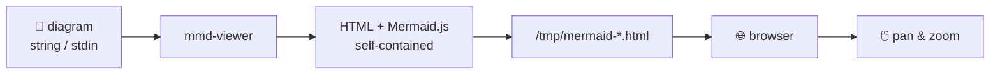

# mmd-viewer

> Instantly render Mermaid diagrams in your browser from the command line.

[](https://github.com/MariusAdrian88/mmd-viewer/actions/workflows/ci.yml)
[](https://github.com/MariusAdrian88/mmd-viewer/releases/latest)
[](LICENSE)

Pass a Mermaid diagram string (or pipe one via stdin) and it opens instantly in your browser with pan and zoom.



## Install

Download the binary for your platform from the [latest release](https://github.com/MariusAdrian88/mmd-viewer/releases/latest):

| Platform | File |
|----------|------|
| Windows (x64) | `mmd-viewer-x86_64-pc-windows-msvc.exe` |
| macOS (Intel) | `mmd-viewer-x86_64-apple-darwin` |
| macOS (Apple Silicon) | `mmd-viewer-aarch64-apple-darwin` |
| Linux (x64) | `mmd-viewer-x86_64-unknown-linux-gnu` |
| Linux (ARM64) | `mmd-viewer-aarch64-unknown-linux-gnu` |

Or build from source:

```bash
cargo install --git https://github.com/MariusAdrian88/mmd-viewer
```

## Usage

**Inline string:**
```bash
mmd-viewer "flowchart LR; A --> B --> C"
```

**From a file via stdin:**
```bash
cat diagram.mmd | mmd-viewer
```

**Custom temp directory:**
```bash
mmd-viewer --temp-dir /path/to/dir "flowchart LR; A --> B"
```

## Building from Source

```bash
git clone https://github.com/MariusAdrian88/mmd-viewer
cd mmd-viewer
cargo build --release
# binary: target/release/mmd-viewer (or .exe on Windows)
```

## License

[MIT](LICENSE)
