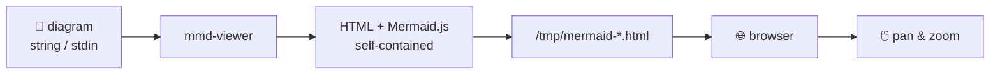

# mmd-viewer Project Setup Implementation Plan

> **For agentic workers:** REQUIRED SUB-SKILL: Use superpowers:subagent-driven-development (recommended) or superpowers:executing-plans to implement this plan task-by-task. Steps use checkbox (`- [ ]`) syntax for tracking.

**Goal:** Add all project scaffolding to make mmd-viewer a proper open-source GitHub project with binary releases for 5 platforms.

**Architecture:** Create project meta-files (.gitignore, LICENSE, CHANGELOG, README), add Cargo metadata, and two GitHub Actions workflows — one for CI on every push/PR and one for tag-triggered multi-platform releases. No changes to `src/main.rs`.

**Tech Stack:** Rust / Cargo, GitHub Actions, `cross` (for Linux ARM64 cross-compilation), `dtolnay/rust-toolchain`, `softprops/action-gh-release`

---

## File Map

| File | Action | Responsibility |
|------|--------|----------------|
| `.gitignore` | Create | Ignore `/target`, keep `mermaid.min.js` and `Cargo.lock` |
| `LICENSE` | Create | MIT license text |
| `CHANGELOG.md` | Create | v0.1.0 release notes stub |
| `README.md` | Create | Docs, Mermaid example, install + usage |
| `Cargo.toml` | Modify | Add metadata fields only (no dep/profile changes) |
| `.github/workflows/ci.yml` | Create | Build + check on push/PR |
| `.github/workflows/release.yml` | Create | Tag-triggered 5-platform binary release |

---

## Task 1: .gitignore

**Files:**
- Create: `.gitignore`

- [ ] **Step 1: Create `.gitignore`**

```
/target
```

Note: `Cargo.lock` is intentionally NOT ignored — for binary crates, committing it ensures reproducible builds. `mermaid.min.js` is intentionally NOT ignored — it is compiled into the binary via `include_str!`.

- [ ] **Step 2: Verify with git**

```bash
git status
```

Expected: `mermaid.min.js` and `Cargo.lock` are shown as untracked (not hidden by gitignore). `/target` directory is not listed.

- [ ] **Step 3: Commit**

```bash
git add .gitignore
git commit -m "chore: add .gitignore"
```

---

## Task 2: MIT License

**Files:**
- Create: `LICENSE`

- [ ] **Step 1: Create `LICENSE`**

```
MIT License

Copyright (c) 2026 MariusAdrian88

Permission is hereby granted, free of charge, to any person obtaining a copy
of this software and associated documentation files (the "Software"), to deal
in the Software without restriction, including without limitation the rights
to use, copy, modify, merge, publish, distribute, sublicense, and/or sell
copies of the Software, and to permit persons to whom the Software is
furnished to do so, subject to the following conditions:

The above copyright notice and this permission notice shall be included in all
copies or substantial portions of the Software.

THE SOFTWARE IS PROVIDED "AS IS", WITHOUT WARRANTY OF ANY KIND, EXPRESS OR
IMPLIED, INCLUDING BUT NOT LIMITED TO THE WARRANTIES OF MERCHANTABILITY,
FITNESS FOR A PARTICULAR PURPOSE AND NONINFRINGEMENT. IN NO EVENT SHALL THE
AUTHORS OR COPYRIGHT HOLDERS BE LIABLE FOR ANY CLAIM, DAMAGES OR OTHER
LIABILITY, WHETHER IN AN ACTION OF CONTRACT, TORT OR OTHERWISE, ARISING FROM,
OUT OF OR IN CONNECTION WITH THE SOFTWARE OR THE USE OR OTHER DEALINGS IN THE
SOFTWARE.
```

- [ ] **Step 2: Commit**

```bash
git add LICENSE
git commit -m "chore: add MIT license"
```

---

## Task 3: CHANGELOG

**Files:**
- Create: `CHANGELOG.md`

- [ ] **Step 1: Create `CHANGELOG.md`**

```markdown
# Changelog

All notable changes to this project will be documented in this file.

## [0.1.0] - 2026-04-18

### Added

- Render Mermaid diagrams in the browser from CLI args or stdin
- Pan and zoom support in the browser viewer
- Pre-built binaries for Windows (x64), macOS (Intel + Apple Silicon), Linux (x64 + ARM64)
```

- [ ] **Step 2: Commit**

```bash
git add CHANGELOG.md
git commit -m "chore: add CHANGELOG stub"
```

---

## Task 4: Cargo.toml Metadata

**Files:**
- Modify: `Cargo.toml`

Current `Cargo.toml` (do NOT touch `[dependencies]` or `[profile.release]`):

```toml
[package]
name = "mmd-viewer"
version = "0.1.0"
edition = "2021"
```

- [ ] **Step 1: Add metadata fields to `[package]`**

Replace the `[package]` section with:

```toml
[package]
name = "mmd-viewer"
version = "0.1.0"
edition = "2021"
description = "Instantly render Mermaid diagrams in your browser from the CLI"
homepage = "https://github.com/MariusAdrian88/mmd-viewer"
repository = "https://github.com/MariusAdrian88/mmd-viewer"
license = "MIT"
keywords = ["mermaid", "diagram", "cli", "viewer", "browser"]
categories = ["command-line-utilities", "visualization"]
```

- [ ] **Step 2: Verify cargo still builds**

```bash
cargo check
```

Expected: no errors.

- [ ] **Step 3: Commit**

```bash
git add Cargo.toml
git commit -m "chore: add Cargo.toml metadata"
```

---

## Task 5: README

**Files:**
- Create: `README.md`

- [ ] **Step 1: Create `README.md`**

````markdown
# mmd-viewer

> Instantly render Mermaid diagrams in your browser from the command line.

[](https://github.com/MariusAdrian88/mmd-viewer/actions/workflows/ci.yml)
[](https://github.com/MariusAdrian88/mmd-viewer/releases/latest)
[](LICENSE)

Pass a Mermaid diagram string (or pipe one via stdin) and it opens instantly in your browser with pan and zoom.



## Install

Download the binary for your platform from the [latest release](https://github.com/MariusAdrian88/mmd-viewer/releases/latest):

| Platform | File |
|----------|------|
| Windows (x64) | `mmd-viewer-x86_64-pc-windows-msvc.exe` |
| macOS (Intel) | `mmd-viewer-x86_64-apple-darwin` |
| macOS (Apple Silicon) | `mmd-viewer-aarch64-apple-darwin` |
| Linux (x64) | `mmd-viewer-x86_64-unknown-linux-gnu` |
| Linux (ARM64) | `mmd-viewer-aarch64-unknown-linux-gnu` |

Or build from source with Cargo:

```bash
cargo install --git https://github.com/MariusAdrian88/mmd-viewer
```

## Usage

**Inline string:**
```bash
mmd-viewer "flowchart LR; A --> B --> C"
```

**From a file via stdin:**
```bash
cat diagram.mmd | mmd-viewer
```

**Custom temp directory:**
```bash
mmd-viewer --temp-dir /path/to/dir "flowchart LR; A --> B"
```

## Building from Source

```bash
git clone https://github.com/MariusAdrian88/mmd-viewer
cd mmd-viewer
cargo build --release
# binary: target/release/mmd-viewer (or .exe on Windows)
```

## License

[MIT](LICENSE)
````

- [ ] **Step 2: Commit**

```bash
git add README.md
git commit -m "docs: add README with usage and Mermaid example"
```

---

## Task 6: CI Workflow

**Files:**
- Create: `.github/workflows/ci.yml`

- [ ] **Step 1: Create `.github/workflows/` directory and `ci.yml`**

```yaml
name: CI

on:
  push:
    branches: [main]
  pull_request:
    branches: [main]

jobs:
  check:
    name: Check (${{ matrix.os }})
    runs-on: ${{ matrix.os }}
    strategy:
      fail-fast: false
      matrix:
        os: [ubuntu-latest, windows-latest, macos-latest]
    steps:
      - uses: actions/checkout@v4
      - uses: dtolnay/rust-toolchain@stable
      - run: cargo check
      - run: cargo build
      - run: cargo test
```

- [ ] **Step 2: Commit**

```bash
git add .github/workflows/ci.yml
git commit -m "ci: add CI workflow for push and PR"
```

---

## Task 7: Release Workflow

**Files:**
- Create: `.github/workflows/release.yml`

- [ ] **Step 1: Create `release.yml`**

```yaml
name: Release

on:
  push:
    tags:
      - 'v*.*.*'

jobs:
  build:
    name: Build ${{ matrix.target }}
    runs-on: ${{ matrix.os }}
    strategy:
      fail-fast: false
      matrix:
        include:
          - target: x86_64-pc-windows-msvc
            os: windows-latest
            ext: .exe
            cross: false
          - target: x86_64-apple-darwin
            os: macos-13
            ext: ""
            cross: false
          - target: aarch64-apple-darwin
            os: macos-latest
            ext: ""
            cross: false
          - target: x86_64-unknown-linux-gnu
            os: ubuntu-latest
            ext: ""
            cross: false
          - target: aarch64-unknown-linux-gnu
            os: ubuntu-latest
            ext: ""
            cross: true

    steps:
      - uses: actions/checkout@v4

      - uses: dtolnay/rust-toolchain@stable
        with:
          targets: ${{ matrix.target }}

      - name: Install cross
        if: matrix.cross
        run: cargo install cross --git https://github.com/cross-rs/cross

      - name: Build (native)
        if: ${{ !matrix.cross }}
        run: cargo build --release --target ${{ matrix.target }}

      - name: Build (cross)
        if: ${{ matrix.cross }}
        run: cross build --release --target ${{ matrix.target }}

      - name: Stage artifact
        shell: bash
        run: |
          cp "target/${{ matrix.target }}/release/mmd-viewer${{ matrix.ext }}" \
             "mmd-viewer-${{ matrix.target }}${{ matrix.ext }}"

      - uses: actions/upload-artifact@v4
        with:
          name: mmd-viewer-${{ matrix.target }}
          path: mmd-viewer-${{ matrix.target }}${{ matrix.ext }}

  release:
    needs: build
    runs-on: ubuntu-latest
    permissions:
      contents: write
    steps:
      - uses: actions/checkout@v4

      - uses: actions/download-artifact@v4
        with:
          path: artifacts
          merge-multiple: true

      - uses: softprops/action-gh-release@v2
        with:
          files: artifacts/*
          body_path: CHANGELOG.md
          draft: false
          prerelease: false
```

- [ ] **Step 2: Commit**

```bash
git add .github/workflows/release.yml
git commit -m "ci: add release workflow for v*.*.* tags"
```

---

## Task 8: Initial Commit of Existing Files

**Context:** `mermaid.min.js`, `Cargo.lock`, and `src/main.rs` are existing files that need to be tracked by git.

- [ ] **Step 1: Stage and commit all remaining untracked files**

```bash
git add mermaid.min.js Cargo.lock src/main.rs
git commit -m "feat: initial mmd-viewer implementation"
```

---

## Task 9: Create GitHub Repo and Push

- [ ] **Step 1: Create the GitHub repo (if not already created)**

Go to https://github.com/new and create `MariusAdrian88/mmd-viewer` as a public repo with no README (we have our own).

- [ ] **Step 2: Add remote and push**

```bash
git remote add origin https://github.com/MariusAdrian88/mmd-viewer.git
git branch -M main
git push -u origin main
```

- [ ] **Step 3: Verify CI triggers**

Go to https://github.com/MariusAdrian88/mmd-viewer/actions — the CI workflow should appear and pass within a few minutes.

---

## Task 10: Tag v0.1.0 and Trigger Release

- [ ] **Step 1: Tag the release**

```bash
git tag v0.1.0
git push origin v0.1.0
```

- [ ] **Step 2: Monitor the release workflow**

Go to https://github.com/MariusAdrian88/mmd-viewer/actions — the Release workflow should start. It will produce 5 jobs (one per platform). When all pass, a GitHub Release is created at https://github.com/MariusAdrian88/mmd-viewer/releases/tag/v0.1.0 with 5 binary attachments.

Expected artifacts:
- `mmd-viewer-x86_64-pc-windows-msvc.exe`
- `mmd-viewer-x86_64-apple-darwin`
- `mmd-viewer-aarch64-apple-darwin`
- `mmd-viewer-x86_64-unknown-linux-gnu`
- `mmd-viewer-aarch64-unknown-linux-gnu`

---

## Self-Review Checklist

- [x] `.gitignore` keeps `mermaid.min.js` and `Cargo.lock` (required for build)
- [x] `Cargo.toml` changes are metadata-only, `[dependencies]` and `[profile.release]` untouched
- [x] `src/main.rs` never referenced for modification
- [x] All 5 release targets covered in matrix
- [x] `cross` only installed when `matrix.cross == true` (saves CI time)
- [x] Release job has `contents: write` permission (required by `softprops/action-gh-release`)
- [x] `mermaid.min.js` committed in Task 8 (without it, `cargo build` fails)
- [x] Task ordering: files created before push, push before tag
