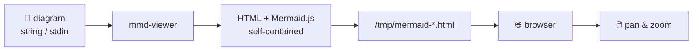

# mmd-viewer — Project Setup Design

**Date:** 2026-04-18  
**Scope:** Add all project scaffolding to make mmd-viewer a proper open-source GitHub project with binary releases. No changes to `src/main.rs`.

---

## Goal

Turn a working Rust CLI tool into a well-presented open-source project that:
- Has a clear README with a self-describing Mermaid diagram example
- Ships pre-built binaries for all major platforms via GitHub Releases
- Runs CI on every push/PR

---

## Files to Create

```
.gitignore                              Rust standard ignore
LICENSE                                 MIT
CHANGELOG.md                            Stub for v0.1.0
README.md                               See README section below
Cargo.toml                              Add metadata fields only (no logic changes)
.github/
  workflows/
    ci.yml                              Build + check on every push/PR
    release.yml                         Tag-triggered multi-platform release
```

---

## Cargo.toml Metadata

Add these fields (no dependency or profile changes):

```toml
description = "Instantly render Mermaid diagrams in your browser from the CLI"
homepage = "https://github.com/{owner}/mmd-viewer"
repository = "https://github.com/{owner}/mmd-viewer"
license = "MIT"
keywords = ["mermaid", "diagram", "cli", "viewer", "browser"]
categories = ["command-line-utilities", "visualization"]
```

---

## README Structure

1. **Title + one-liner** — "mmd-viewer: render Mermaid diagrams in your browser instantly"
2. **Badges** — CI status, Latest Release, License
3. **Mermaid example** — a `mermaid` code block describing the tool's own pipeline (GitHub renders natively):



4. **Install** — download binary from Releases OR `cargo install mmd-viewer`
5. **Usage** — CLI args example, stdin pipe example
6. **Building from source** — `cargo build --release`

---

## CI Workflow (`ci.yml`)

Triggers: push to `main`, pull requests to `main`

Steps:
- `cargo check`
- `cargo build`
- `cargo test`

Runs on: `ubuntu-latest`, `windows-latest`, `macos-latest`

---

## Release Workflow (`release.yml`)

Trigger: push of a tag matching `v*.*.*`

Build matrix (5 targets):

| Target | Runner | Cross-compile |
|--------|--------|---------------|
| x86_64-pc-windows-msvc | windows-latest | no |
| x86_64-apple-darwin | macos-13 | no |
| aarch64-apple-darwin | macos-latest | no |
| x86_64-unknown-linux-gnu | ubuntu-latest | no |
| aarch64-unknown-linux-gnu | ubuntu-latest | yes (`cross`) |

Artifact naming: `mmd-viewer-{target}` (`.exe` on Windows).

Steps per job:
1. Checkout
2. Install Rust stable
3. (Linux ARM only) Install `cross`
4. Build release binary
5. Upload artifact

Final job: create GitHub Release, attach all 5 artifacts, body from `CHANGELOG.md`.

---

## CHANGELOG Stub

```markdown
# Changelog

## [0.1.0] - 2026-04-18
### Added
- Initial release
- Render Mermaid diagrams in the browser from CLI args or stdin
- Pan and zoom support
- Pre-built binaries for Windows, macOS (Intel + Apple Silicon), Linux (x64 + ARM64)
```

---

## What Is NOT Changed

- `src/main.rs` — untouched
- `[dependencies]` in `Cargo.toml` — untouched
- `[profile.release]` in `Cargo.toml` — untouched

---

## Success Criteria

- `cargo check` passes in CI on all 3 OSes
- Pushing a `v0.1.0` tag produces a GitHub Release with 5 binary attachments
- README renders correctly on GitHub with the Mermaid diagram visible
